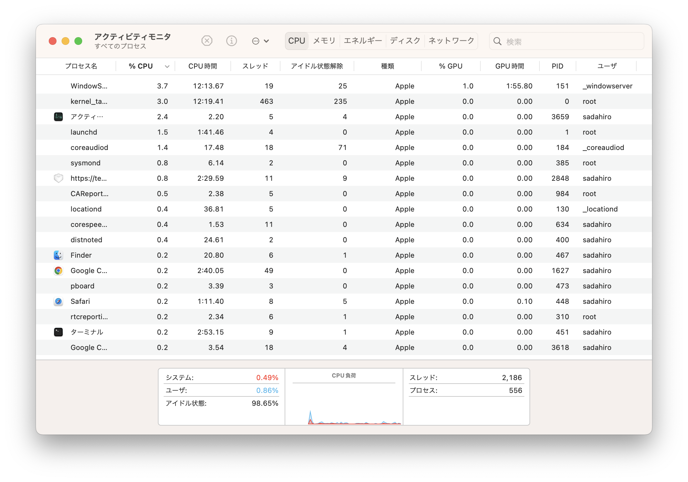

# ファイルの属性

<code>ls -l</code>の出力する情報をもう少し詳しく
みます。

* 上の図の赤く囲まれた部分は各ファイルの
  種類とパーミッションを表します。

* 青い枠線で囲まれた部分はファイルの所有者を表します。

* 緑で囲まれた部分はファイルサイズを表します。

* オレンジで囲まれた部分はファイルが変更された時刻を表します。

* 紫で囲まれた部分はファイル名を表します。

## パーミッション

パーミッションを表す部分の
最初の1文字はファイルの種類を表します。

|記号|意味|
| --- | ------ |
| <code>-</code> | ファイル |
| --- | ------ |
| <code>d</code> | ディレクトリ |
| --- | ------ |
| <code>l</code> | シンボリックリンク |

2文字目以降は3文字ごとにファイルの持ち主、グループ、
一般のパーミッションを表します。
つまり、2文字目から4文字目の3文字は
ファイル所有者の読み出し、書き込み、実行の
許可を表しています。

|記号|意味|
|-|-|
|r|読み出し可|
|w|書き込み可|
|x|実行可|
|-|不可|

ディレクトリの実行可はそのディレクトリに<code>cd</code>
で移動可能であることや<code>ls</code>で
情報を読み取ることが可能であることを意味しています。

## chmod

パーミッションを変更するには
<code>chmod</code>コマンドを用います。
例えば実行不可にするには<code>-x</code>
オプション読み出し可にするには
<code>+r</code>オプションを使います。

<pre>
sadahiro@taizoair scripts % ls -l
total 128
-rw-r--r--@ 1 sadahiro  staff     12  4 26 22:07 hello.text
-rw-r--r--  1 sadahiro  staff     33  4 20 11:41 long.aux
-rw-r--r--  1 sadahiro  staff  22996  4 20 11:41 long.log
-rw-r--r--@ 1 sadahiro  staff  15854  4 20 11:41 long.pdf
-rw-r--r--@ 1 sadahiro  staff    148  4 20 08:25 long.tex
drwxr-xr-x  3 sadahiro  staff     96  4 23 19:10 newfolder
-rw-r--r--@ 1 sadahiro  staff    158  4 20 08:27 rep.rb
-rw-r--r--  1 sadahiro  staff   1684  4 20 08:27 rep.tex
-rwxr-xr-x@ 1 sadahiro  staff    185  4 20 11:42 test.sh
sadahiro@taizoair scripts % chmod -x newfolder 
sadahiro@taizoair scripts % ls -l
total 128
-rw-r--r--@ 1 sadahiro  staff     12  4 26 22:07 hello.text
-rw-r--r--  1 sadahiro  staff     33  4 20 11:41 long.aux
-rw-r--r--  1 sadahiro  staff  22996  4 20 11:41 long.log
-rw-r--r--@ 1 sadahiro  staff  15854  4 20 11:41 long.pdf
-rw-r--r--@ 1 sadahiro  staff    148  4 20 08:25 long.tex
drw-r--r--  3 sadahiro  staff     96  4 23 19:10 newfolder
-rw-r--r--@ 1 sadahiro  staff    158  4 20 08:27 rep.rb
-rw-r--r--  1 sadahiro  staff   1684  4 20 08:27 rep.tex
-rwxr-xr-x@ 1 sadahiro  staff    185  4 20 11:42 test.sh
</pre>

<pre>
sadahiro@taizoair scripts % cd newfolder 
cd: permission denied: newfolder
sadahiro@taizoair scripts % chmod +x newfolder 
sadahiro@taizoair scripts % cd newfolder 
sadahiro@taizoair newfolder % pwd
/Users/sadahiro/2pro/scripts/newfolder
</pre>

## chown

<code>chown ユーザ名:グループ ファイルまたはディレクトリ名</code>
コマンドにより、ファイルやディレクトリの所有者、グループを
変更することが出来ます。

# ファイルの検索

以下では指定したフォルダの中から名前により
ファイルやディレクトリを検索する方法を試します。

検索には<code>find</code>コマンドを用います。
<pre>
find ディレクトリ名 -name パターン
</pre>
で指定されたディレクトリからファイル名が
パターンにマッチするものをサブディレクトリも
含めて検索します。

<pre>
sadahiro@taizoair scripts % ls
1.pdf		4.pdf		8.pdf		long.log	rep.rb
10.pdf		5.pdf		9.pdf		long.pdf	rep.tex
2.pdf		6.pdf		hello.text	long.tex	test.sh
3.pdf		7.pdf		long.aux	newfolder
sadahiro@taizoair scripts % find . -name "[0-9]*.pdf"
./9.pdf
./8.pdf
./10.pdf
./6.pdf
./7.pdf
./5.pdf
./4.pdf
./1.pdf
./3.pdf
./2.pdf
</pre>

## -ok -exec

### -ok

<code>-ok</code>オプションは見つけたファイルに
対してコマンドを確認しながら実行します。

<pre>
sadahiro@taizoair scripts % find . -name "[0-9]*.pdf" -ok rm {} \;
"rm ./9.pdf"? n
"rm ./8.pdf"? n
"rm ./10.pdf"? n
"rm ./6.pdf"? n
"rm ./7.pdf"? n
"rm ./5.pdf"? n
"rm ./4.pdf"? n
"rm ./1.pdf"? y
"rm ./3.pdf"? y
"rm ./2.pdf"? y
sadahiro@taizoair scripts % ls   
10.pdf		7.pdf		long.aux	newfolder
4.pdf		8.pdf		long.log	rep.rb
5.pdf		9.pdf		long.pdf	rep.tex
6.pdf		hello.text	long.tex	test.sh
</pre>

ここで<code>{} </code>には見つかったファイル名が
代入されます。最後の<code> \;</code>の直前にスペースが
必要です。

### -exec

<code>-exec</code>オプションは確認せずに与えられた
コマンドを実行します。

<pre>
sadahiro@taizoair scripts % find . -name "[0-9]*.pdf" -exec rm {} \;
sadahiro@taizoair scripts % ls
hello.text	long.log	long.tex	rep.rb		test.sh
long.aux	long.pdf	newfolder	rep.tex
</pre>

# プロセス

プロセスとは実行されているプログラムの実行状態のことです。
「アプリケーション」の中にある「アクティビティモニタ」を
用いてプロセスを調べることが出来ます。

## ps

ターミナルからももちろんプロセスの情報を得ることが
出来ます。プロセスを表示させるには<code>ps</code>
コマンドを使います。
<code>PID</code>はプロセスのIDであり、

<pre>
sadahiro@taizoair scripts % ps
  PID TTY           TIME CMD
  541 ttys000    0:00.10 -zsh
  985 ttys000    0:11.06 emacs -nw lessons/l2.md
 1136 ttys001    0:00.69 -zsh
 1521 ttys002    0:00.04 -zsh
 1590 ttys002    0:05.13 /Users/sadahiro/.rbenv/versions/3.2.1/bin/jekyll serve
 1605 ttys002    0:00.99 /Users/sadahiro/.gem/ruby/3.2.0/gems/rb-fsevent-0.11.2
</pre>

### A

<code>ps A</code>とすることによりシステム上で
現在実行されている全てのプロセスが表示されます。

<pre>
sadahiro@taizoair scripts % ps -A
  PID TTY           TIME CMD
    1 ??         1:46.60 /sbin/launchd
   84 ??         0:46.62 /usr/libexec/logd
   85 ??         0:00.02 /usr/libexec/smd
   86 ??         0:08.17 /usr/libexec/UserEventAgent (System)
   88 ??         0:01.07 /System/Library/PrivateFrameworks/Uninstall.framework/
   89 ??         0:34.43 /System/Library/Frameworks/CoreServices.framework/Vers
   90 ??         0:00.89 /System/Library/PrivateFrameworks/MediaRemote.framewor
   93 ??         0:04.34 /usr/sbin/systemstats --daemon
   95 ??         0:14.72 /usr/libexec/configd
   96 ??         0:00.02 endpointsecurityd
   97 ??         0:17.95 /System/Library/CoreServices/powerd.bundle/powerd
   (以下略)
</pre>

### aux

<code>ps aux</code>とすることによりシステム上で
現在実行されている全てのプロセスがユーザ情報、
時刻を含めて表示されます。

<pre>
sadahiro@taizoair scripts % ps aux
USER               PID  %CPU %MEM      VSZ    RSS   TT  STAT STARTED      TIME COMMAND
sadahiro           451   6.2  1.6 410436720 274832   ??  S    土11AM   3:30.36 /System/Applications/Utilities/Terminal.app/Contents/MacOS/Terminal
_windowserver      151   5.3  1.1 410780048 189280   ??  Ss   土11AM  16:01.71 /System/Library/PrivateFrameworks/SkyLight.framework/Resources/WindowServer -daemon
sadahiro          3659   2.9  0.7 409946752 114528   ??  S    11:00AM   1:17.55 /System/Applications/Utilities/Activity Monitor.app/Contents/MacOS/Activity Monitor
root               385   2.2  0.0 408234256   6512   ??  Ss   土11AM   0:57.19 /usr/libexec/sysmond
root              3852   1.9  0.0 408768448   2576 s001  R+   11:47AM   0:00.01 ps aux
</pre>

## kill

<code>kill</code>コマンドはプロセスに**シグナル**を
送ることが出来ます。
シグナルには様々な種類がありますが、例えば、
プロセスを終了させたい場合はKILLシグナルを送ります。

ターミナルを新たに開き、<code>cat</code>コマンドを
実行します。このコマンドは標準入力からの入力を読み取り、
標準出力に出力します。
<pre>
(ターミナルA)
sadahiro@taizoair ~ % cat
Hello
Hello
World
World

</pre>

別ターミナルから、プロセスを観察すると次のように
表示されます。<code>cat</code>コマンドが実行中で
あり、プロセスIDが4077であることが分かります。
<pre>
sadahiro@taizoair docs % ps
  PID TTY           TIME CMD
  541 ttys000    0:00.10 -zsh
  985 ttys000    0:13.87 emacs -nw lessons/l2.md
 1136 ttys001    0:00.72 -zsh
 1521 ttys002    0:00.04 -zsh
 1590 ttys002    0:06.00 /Users/sadahiro/.rbenv/versions/3.2.1/bin/jekyll serve
 1605 ttys002    0:01.17 /Users/sadahiro/.gem/ruby/3.2.0/gems/rb-fsevent-0.11.2
 4035 ttys003    0:00.02 -zsh
 4077 ttys003    0:00.00 cat
</pre>

ここで<code>kill -KILL</code>コマンドで
プロセスを停止します。

<pre>
sadahiro@taizoair docs % kill -KILL 4077
sadahiro@taizoair docs % ps
  PID TTY           TIME CMD
  541 ttys000    0:00.12 -zsh
  985 ttys000    0:14.55 emacs -nw lessons/l2.md
 1136 ttys001    0:00.72 -zsh
 1521 ttys002    0:00.04 -zsh
 1590 ttys002    0:06.15 /Users/sadahiro/.rbenv/versions/3.2.1/bin/jekyll serve
 1605 ttys002    0:01.18 /Users/sadahiro/.gem/ruby/3.2.0/gems/rb-fsevent-0.11.2
 4035 ttys003    0:00.02 -zsh
</pre>

<code>cat</code>を実行していたターミナルでは
<code>cat</code>が終了しています。

<pre>
(ターミナルA)
sadahiro@taizoair ~ % cat
Hello
Hello
World
World
zsh: killed     cat
sadahiro@taizoair ~ % 
</pre>
