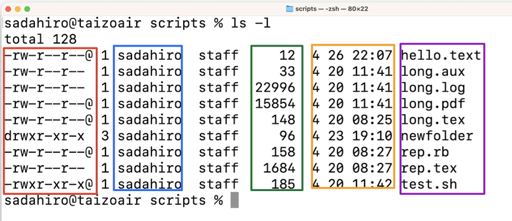

# ファイルの属性

<code>ls -l</code>の出力する情報をもう少し詳しく
みます。

* 上の図の赤く囲まれた部分は各ファイルの
  種類とパーミッションを表します。

* 青い枠線で囲まれた部分はファイルの所有者を表します。

* 緑で囲まれた部分はファイルサイズを表します。

* オレンジで囲まれた部分はファイルが変更された時刻を表します。

* 紫で囲まれた部分はファイル名を表します。

## パーミッション

パーミッションを表す部分の
最初の1文字はファイルの種類を表します。

|記号|意味|
| --- | ------ |
| <code>-</code> | ファイル |
| --- | ------ |
| <code>d</code> | ディレクトリ |
| --- | ------ |
| <code>l</code> | シンボリックリンク |

2文字目以降は3文字ごとにファイルの持ち主、グループ、
一般のパーミッションを表します。
つまり、2文字目から4文字目の3文字は
ファイル所有者の読み出し、書き込み、実行の
許可を表しています。

|記号|意味|
|-|-|
|r|読み出し可|
|w|書き込み可|
|x|実行可|
|-|不可|

ディレクトリの実行可はそのディレクトリに<code>cd</code>
で移動可能であることや<code>ls</code>で
情報を読み取ることが可能であることを意味しています。

## chmod

パーミッションを変更するには
<code>chmod</code>コマンドを用います。
例えば実行不可にするには<code>-x</code>
オプション読み出し可にするには
<code>+r</code>オプションを使います。

<pre>
sadahiro@taizoair scripts % ls -l
total 128
-rw-r--r--@ 1 sadahiro  staff     12  4 26 22:07 hello.text
-rw-r--r--  1 sadahiro  staff     33  4 20 11:41 long.aux
-rw-r--r--  1 sadahiro  staff  22996  4 20 11:41 long.log
-rw-r--r--@ 1 sadahiro  staff  15854  4 20 11:41 long.pdf
-rw-r--r--@ 1 sadahiro  staff    148  4 20 08:25 long.tex
drwxr-xr-x  3 sadahiro  staff     96  4 23 19:10 newfolder
-rw-r--r--@ 1 sadahiro  staff    158  4 20 08:27 rep.rb
-rw-r--r--  1 sadahiro  staff   1684  4 20 08:27 rep.tex
-rwxr-xr-x@ 1 sadahiro  staff    185  4 20 11:42 test.sh
sadahiro@taizoair scripts % chmod -x newfolder 
sadahiro@taizoair scripts % ls -l
total 128
-rw-r--r--@ 1 sadahiro  staff     12  4 26 22:07 hello.text
-rw-r--r--  1 sadahiro  staff     33  4 20 11:41 long.aux
-rw-r--r--  1 sadahiro  staff  22996  4 20 11:41 long.log
-rw-r--r--@ 1 sadahiro  staff  15854  4 20 11:41 long.pdf
-rw-r--r--@ 1 sadahiro  staff    148  4 20 08:25 long.tex
drw-r--r--  3 sadahiro  staff     96  4 23 19:10 newfolder
-rw-r--r--@ 1 sadahiro  staff    158  4 20 08:27 rep.rb
-rw-r--r--  1 sadahiro  staff   1684  4 20 08:27 rep.tex
-rwxr-xr-x@ 1 sadahiro  staff    185  4 20 11:42 test.sh
</pre>

<pre>
sadahiro@taizoair scripts % cd newfolder 
cd: permission denied: newfolder
sadahiro@taizoair scripts % chmod +x newfolder 
sadahiro@taizoair scripts % cd newfolder 
sadahiro@taizoair newfolder % pwd
/Users/sadahiro/2pro/scripts/newfolder
</pre>

## chown

<code>chown ユーザ名:グループ ファイルまたはディレクトリ名</code>
コマンドにより、ファイルやディレクトリの所有者、グループを
変更することが出来ます。

# ファイルの検索

以下では指定したフォルダの中から名前により
ファイルやディレクトリを検索する方法を試します。

検索には<code>find</code>コマンドを用います。
<pre>
find ディレクトリ名 -name パターン
</pre>
で指定されたディレクトリからファイル名が
パターンにマッチするものをサブディレクトリも
含めて検索します。

<pre>
sadahiro@taizoair scripts % ls
1.pdf		4.pdf		8.pdf		long.log	rep.rb
10.pdf		5.pdf		9.pdf		long.pdf	rep.tex
2.pdf		6.pdf		hello.text	long.tex	test.sh
3.pdf		7.pdf		long.aux	newfolder
sadahiro@taizoair scripts % find . -name "[0-9]*.pdf"
./9.pdf
./8.pdf
./10.pdf
./6.pdf
./7.pdf
./5.pdf
./4.pdf
./1.pdf
./3.pdf
./2.pdf
</pre>

